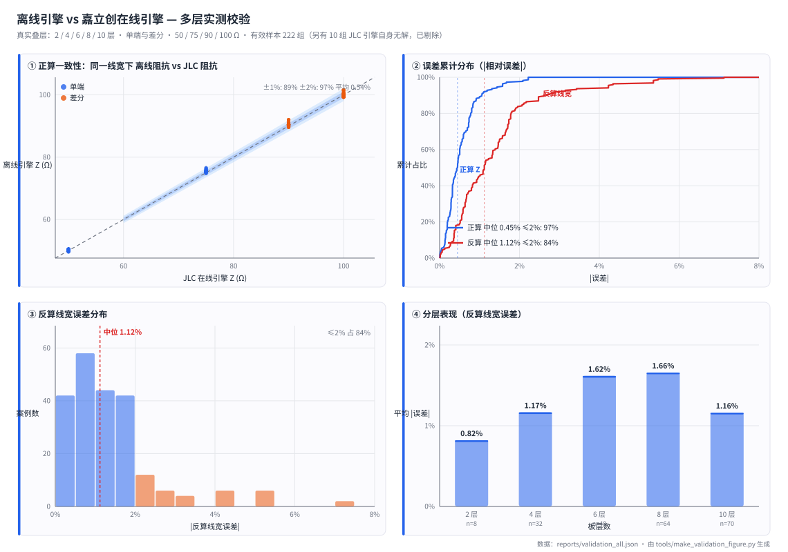

# PCB 阻抗计算器

按叠层和目标阻抗解线宽，也可以反过来：按线宽算阻抗。覆盖 12 种 SI9000 结构
—— 表面微带、涂层微带、偏置带状线、共面波导，以及它们各自的差分形式。

代码分两个引擎：

- **离线引擎**（默认）。物理场解 + 数据校准，运行时只用 Python 标准库，
  不联网。单次正算约 4 ms，反算约 0.3 s（60 步二分，每次迭代做一次正算）。
- **在线引擎**。调用嘉立创在线阻抗计算器的接口取结果，用于对拍和数据采样。

离线引擎以嘉立创在线计算器为参考基准。在 222 组真实叠层用例上，同一线宽下的
阻抗偏差平均 0.54%，反算线宽偏差平均 1.39%。

Python 3.14+ · 运行时零依赖 · 52 个离线测试 · MIT

版本下限设在 3.14。语法与标准库调用静态核对下来兼容 3.9+，但只在 3.14 上跑过
测试，所以只声明实测过的版本；要放宽改 `pyproject.toml` 的 `requires-python` 即可。

## 快速开始

```bash
# 反算：叠层 + 目标阻抗 → 线宽（默认离线引擎）
python -m impedance_calculator solve --stackup JLC04161H-7628 --layer L1 L2 --z0 50
#   L1  CoatedMicrostrip1B  线宽 W1 = 13.952 mil (0.3544 mm)  实际阻抗 = 50.000 Ω  [analytic]
#   L2  OffsetStripline1B1A 线宽 W1 = 11.067 mil (0.2811 mm)  实际阻抗 = 50.000 Ω  [analytic]
#       (离线模型：反算线宽典型误差 ±1.6% / ±3.0%)

# 正算：线宽 → 阻抗
python -m impedance_calculator forward --stackup JLC04161H-7628 --layer L2 --width 11.067
#   L2  OffsetStripline1B1A  阻抗 = 49.999 Ω  [analytic]

# 同一组参数改走在线引擎取真值
python -m impedance_calculator solve --stackup JLC04161H-7628 --layer L2 --z0 50 --online
#   L2  OffsetStripline1B1A  线宽 W1 = 10.879 mil (0.2763 mm)  实际阻抗 = 50.001 Ω  [online]

# 导出 KiCad 设计规则片段
python -m impedance_calculator rules --stackup JLC04161H-3313 --layer L1 \
    --z0-single 50 --z0-diff 100
```

```python
from impedance_calculator import JlcApi, ImpedanceCalculator, stackup

st = stackup.BUILTIN_STACKUPS["JLC04161H-7628"]

calc = ImpedanceCalculator(st)                 # 离线，不传 api
sol = calc.solve("L2", 50)
print(sol.width, sol.impedance, sol.note)
# 11.067  50.0  离线模型：反算线宽典型误差 ±3.0%（建议用在线模式核对）

with JlcApi() as api:                          # 在线
    print(ImpedanceCalculator(st, api=api).solve("L2", 50).width)
```

## 精度

### 与嘉立创的对照（真实叠层，222 组有效用例）

用例取自嘉立创的 9 个通用叠层，每一层铜各取单端 50 / 75 Ω、差分 90 / 100 Ω。
两组口径：

- **正算**：把嘉立创解出的线宽原样喂给离线引擎，比较两者给出的阻抗。
- **反算**：离线引擎自己解线宽，与嘉立创解出的线宽比较。

| 口径 | 平均 | 中位 | P90 | 最大 | ≤1% | ≤2% |
|---|---|---|---|---|---|---|
| 正算 Z 偏差 | 0.54% | 0.45% | 1.05% | 2.22% | 89% | 97% |
| 反算线宽偏差 | 1.39% | 1.12% | 2.61% | 7.12% | 45% | 84% |



分层结果：

| 层数 | 用例 | 平均 | 中位 | 最大 |
|---|---|---|---|---|
| 2 层 | 8 | 0.82% | 0.78% | 1.64% |
| 4 层 | 32 | 1.17% | 1.15% | 2.17% |
| 6 层 | 48 | 1.62% | 1.40% | 7.12% |
| 8 层 | 64 | 1.66% | 1.09% | 5.48% |
| 10 层 | 70 | 1.16% | 1.09% | 4.34% |
| 合计 | 222 | 1.39% | 1.12% | 7.12% |

误差超过 3% 的共 18 例，分两类：8 例是 W < 3 mil 的 75 Ω 薄介质内层，已低于
嘉立创的工艺下限（约 3.5 mil）；另外 10 例集中在 `JLC08161H-2116` 的差分结构上
（90 / 100 Ω，W 为 5.7~8.1 mil）。另有 10 组用例因为嘉立创引擎自己返回
`status=6` 而拿不到参考值，未计入统计。逐条结果见
[`reports/validation_all.json`](reports/validation_all.json)，
带图表的版本见 [`reports/validation_report.html`](reports/validation_report.html)。

### 独立留出集（168 组）

真实叠层的几何分布接近实际设计，因此上面的数字代表日常使用的精度。仓库里另存
一份独立留出集：均匀撒在整个参数空间，含大量极端和边缘几何，从不参与拟合与特征
选择。它是唯一无偏的口径，用来比较不同算法的优劣。

12 个结构的两级模型在留出集上的反算线宽误差，平均 4.28%：

| 结构 | 误差 | | 结构 | 误差 |
|---|---|---|---|---|
| SurfaceMicrostrip1B | 0.29% | | CoatedCoplanar…WithLowerGnd1B | 4.62% |
| CoatedMicrostrip1B | 1.62% | | OffsetCoplanarWaveguide1B1A | 5.00% |
| SurfaceCoplanar… | 2.32% | | DiffCoatedCoplanar… | 5.08% |
| OffsetStripline1B1A | 3.02% | | DiffOffsetStripline1B1A | 5.20% |
| DiffEdgeCoupledSurfaceMicrostrip1B | 3.02% | | DiffSurfaceCoplanar… | 5.63% |
| DiffEdgeCoupledCoatedMicrostrip1B | 3.87% | | DiffOffsetCoplanar… | 11.64% |

两个口径不可混用：前者代表实际设计的精度，后者反映算法在整个参数空间的表现。
两者都是相对嘉立创引擎的偏差，不是相对物理真值。

### 校准层的作用

纯物理公式、只加线性修正、线性加核残差，三者在留出集上的对比：

| 结构 | 纯物理公式 | +线性 | +核残差（出厂） |
|---|---|---|---|
| SurfaceMicrostrip1B | 1.5% | 0.4% | 0.3% |
| CoatedMicrostrip1B | 4.3% | 1.4% | 1.6% |
| OffsetStripline1B1A | 13.0% | 5.1% | 3.0% |
| DiffEdgeCoupledSurfaceMicrostrip1B | 11.4% | 8.1% | 3.0% |
| DiffSurfaceCoplanar… | 28.5% | 9.2% | 5.6% |
| DiffOffsetCoplanar… | 21.1% | 10.1% | 11.6% |

（完整 12 行见 [`reports/calibration_report.md`](reports/calibration_report.md)）

物理公式单独用时误差 1.5%~28.5%，说明误差主要来自铜厚、梯形线、多介质和耦合，
而不在基本公式。加上核残差级后，12 个结构里 10 个再降 21%~63%，平均从 6.64% 降到
4.28%；两个例外（`CoatedMicrostrip1B` 和 `DiffOffsetCoplanarWaveguide1B1A`）反而
略差，后者是四导体强二维问题且样本最少。

### 参考基准本身的可复现性

离线的精度上限取决于参考基准的确定性。同一组参数连发 3 次、覆盖 12 个结构，
结果极差为 0.000000 Ω；嘉立创自己的反算（goal-seek）解出线宽后回代，偏差约
±0.01 Ω。基准本身没有噪声，因此测量到的误差全部来自模型。

## 实现

```
calculator.py ─┬─→ 在线引擎 api.py ──→ tools.jlc.com（SI9000）    参考基准
               └─→ 离线引擎
```

离线引擎分三级，`Z = Z_base · exp(线性项 + 核残差项)`：

- **物理基底**。逐结构单独实现：带状线用方法矩解 T→0 的精确准静态场，微带用
  Hammerstad 公式，共面波导用 Ghione–Naldi 共形映射。
- **线性项**。每个结构 10 项对数线性系数，存在 `_coefs.py`。
- **核残差项**。对线性级的残差做 RBF 核岭回归，支持集存在 `_krrs.py`。

逐层介质、铜厚、梯形线宽、耦合间距等信息由 `stackup.py` 按叠层解析成 SI9000
参数。

| 模块 | 职责 |
|---|---|
| `structures.py` | 12 个 SI9000 结构的定义 |
| `stackup.py` | 叠层解析 → SI9000 参数（含 H1 / H2 的分配规则） |
| `mom.py` | T→0 精确准静态场解（方法矩 + Galerkin，Chebyshev 基） |
| `analytic.py` | 物理基底、正算与反算 |
| `calibration.py` | 校准层（线性 + 核），对外只暴露 `apply_correction` |
| `calculator.py` | 高层门面：叠层 + 目标阻抗 → 线宽 |
| `api.py` | 在线引擎（HTTP + 自己实现的 WebSocket，只用标准库） |
| `mlmodels.py` | 拟合后端：KRR / GP / MLP / 堆叠 / 分层收缩，仅 `tools/` 使用 |

`impedance_calculator` 是可直接交付的库，零外部依赖；`tools/` 是生成和验证它的脚本；
`tools/experiments/` 保存被否掉的方案的对照实验，供复核。

## 设计决策

**用场解替代拟合公式。** 带状线最初用「等效高度微带」近似，基底误差 13%~17%。
改成方法矩后，对嘉立创 T=0.01 mil 的实测值（`data/zerocopper.jsonl`）单端
RMS 0.066%、差分 RMS 0.105%。拟合出来的公式没有泛化保证，而场解自带物理约束：
差分间距 S1 趋于无穷时 `Zdiff/(2Z0)` 精确为 1.0000；H1 与 H2 互换结果完全一致
（实测差 0），嘉立创引擎在同一组互换参数上差 0.4%。代价是每次约 4 ms 的场解开销。

**校准分两级。** 同一留出集、7 个后端：

| 后端 | 平均线宽误差 | 中位 |
|---|---|---|
| 线性级 | 6.64% | 7.46% |
| 核岭回归（krr） | 4.69% | 3.95% |
| 高斯过程（gp） | 4.59% | 3.30% |
| 线性 + 核残差（出厂） | 4.28% | 4.24% |
| 多任务分层收缩（shrink） | 15.49% | 12.72% |
| 符号回归（symbolic） | 14.53% | 16.15% |
| 单隐层神经网络（mlp） | 21.74% | 16.91% |

后三个反而远差于线性级。MLP 有约 120 个参数，而每个结构的训练折只有几十个样本；
多任务收缩直接作用在各结构的系数上，但它们的特征语义并不同；符号回归能给出可读
公式（如 `ln(Z/Z_base) = 0.0316·log((c−x)−(w−1.17)) − 0.052`），精度不够。
它们的实验脚本都保留在 `tools/experiments/`。

高斯过程的预测方差不可用：`|误差|` 与预测标准差的相关系数为 −0.09~−0.28（负相关），
对真实外推也仍给出零方差。原因在特征全是物理量的对数比值，参数范围被压缩，
真实外推在特征空间里并不远。

**采样分布比样本数量更重要。** 首轮 750 组是纯空间填充（H1、H2 独立取值），
结果内层结构只有 15% 的样本落在真实叠层区间里，60 个样本中约 9 个可用。第二轮
按用途补采：内层沿真实叠层流形 320 组、外层大 H 240 组、厚铜 160 组，另加 180 组
独立留出集和 60 组反算对拍。内层有效样本从约 10 升到约 100，落在真实叠层区间的
比例升到 36%~43%。非物理几何（介质小于 3 mil、T/H 逼近 1）共剔除 104 条。

**留出集必须独立。** `forward_select` 在全量数据上挑选特征，因此训练集 5 折交叉
验证对线性级偏乐观。实测：线性级 CV 6.29%、留出集 6.64%；核方法 CV 6.78%、
留出集 4.69%。只看 CV 会得出「核方法不如线性」的结论，从而砍掉真正有用的那一级。

## 适用边界

- 校准覆盖的采样范围：H1 4~129 mil、H2 0.9~59 mil、W 3~158 mil、T 0.6~2.4 mil、
  Er 3.9~4.7。超出这个范围请用在线模式。
- 结构越接近强二维问题（共面、内层差分），校准越吃力。
  `DiffOffsetCoplanarWaveguide1B1A` 的留出集误差约 12%，建议直接用在线引擎。
- 换板材（如 Rogers）需要重新采样，现有校准与新板材无关。
- 目前只覆盖嘉立创，未接入其它板厂。
- 没有任何校准文件时模块仍可工作，退化为纯教科书公式。

## API

```python
ImpedanceCalculator(stackup, api=None)          # api=None 即离线
  .solve(layer, z0, kind='single'|'diff', coplanar=False,
         spacing=None, gap=None, width=None)    # 阻抗 → 线宽
  .forward(layer, width, kind='single', ...)    # 线宽 → 阻抗

Solution
  .width  .width_mm  .spacing  .gap  .impedance  .engine  .note
  .as_dict()

JlcApi()                                        # 在线引擎（上下文管理器）
  .calculate(type, params)  .solve(type, param, params, target)
  .templates(layers, thickness, ...)  .config_copper()  .config_coverlay()

impedance_calculator.calibration.width_cv(type)        # 该结构的留出集误差（%）
impedance_calculator.calibration.quality_note(type)    # 给结果加的可信度说明
```

```bash
python -m impedance_calculator list                     # 列出叠层与 12 个结构
python -m impedance_calculator show    --stackup <名>   # 叠层 → SI9000 参数
python -m impedance_calculator solve   --stackup <名> --layer L1 L2 --z0 50
python -m impedance_calculator forward --stackup <名> --layer L1 --width 8
python -m impedance_calculator rules   --stackup <名> --layer L1 --z0-single 50 --z0-diff 100

# 各子命令都接受 --online，改用在线引擎取真值
python -m impedance_calculator solve --stackup <名> --layer L1 --z0 50 --online
```

## 复现

```bash
# 0) 离线测试，不需要网络
python -m unittest discover -s tests -t .

# 1) 取嘉立创的叠层并缓存（6 个请求）
python tools/fetch_stackups.py --refresh

# 2) 采样（约 960 个请求，间隔 0.9~1.6 s，共约 28 分钟）
python tools/collect.py --plan      # 先看计划
python tools/collect.py

# 3) 测参考基准的可靠性，并采 T=0.01 的验证点（约 63 个请求）
python tools/check_engine.py

# 4) 拟合 → impedance_calculator/_coefs.py、_krrs.py、reports/calibration_report.md
python tools/fit_calibration.py

# 5) 全层数校验 → reports/validation_all.json、validation_report.html（232 个请求）
python tools/validate_layers.py

# 6) 校验图 → reports/figures/validation.svg
python tools/make_validation_figure.py

# 7) 后端对照实验 → reports/backend_comparison.md
python tools/experiments/compare_backends.py --symbolic

# 8) 生成 2/4/6/8/10 层的 KiCad 叠层与设计规则模板（可选）
python tools/make_kicad_templates.py            # 默认写到仓库旁的 PCB TEMPLATE/
python tools/make_kicad_templates.py --out DIR  # 或指定目录
python tools/check_templates.py --out DIR

# 9) 逐步打印一次完整计算，对着代码看
python examples/walkthrough.py
```

原始数据在 `data/`，结论在 `reports/`，两者都在版本控制里，因此所有结论可复核。

## 目录结构

```
impedance_calculator/             项目根，也是仓库里的同名目录
├── impedance_calculator/         Python 包（零依赖，可 pip install）
│   ├── __main__.py               CLI
│   ├── api.py                    在线引擎
│   ├── structures.py             12 个 SI9000 结构
│   ├── stackup.py                叠层解析与内置叠层
│   ├── mom.py                    T→0 精确场解
│   ├── analytic.py               物理基底、正算与反算
│   ├── calibration.py            校准层
│   ├── calculator.py             高层门面
│   ├── mlmodels.py               拟合后端
│   ├── _coefs.py                 生成物，勿手改
│   ├── _krrs.py                  生成物，勿手改
│   └── py.typed                  PEP 561 类型标记
├── tools/                        生成与验证
│   ├── _common.py                共享层：数据、拟合、度量
│   ├── fetch_stackups.py         取叠层并缓存
│   ├── collect.py                采样（6 种 regime，可断点续采）
│   ├── check_engine.py           测重复性、正反算自洽，采 T=0.01 验证点
│   ├── fit_calibration.py        拟合校准层
│   ├── validate_layers.py        全层数校验
│   ├── make_validation_figure.py 校验图（手写 SVG）
│   ├── make_width_table.py       叠层速查表
│   ├── make_kicad_templates.py   生成 KiCad 模板
│   ├── check_templates.py        复验 KiCad 模板
│   ├── kicad_ref/                模板生成器用的参考文件
│   └── experiments/              被否掉的方案
├── data/                         采样数据
├── reports/                      生成的报告与校验图
├── examples/walkthrough.py       逐步讲解一次完整计算
└── tests/                        52 个离线测试
```

工具脚本之间不互相 import，共享代码只放在 `tools/_common.py`，依赖方向始终是
`tools/* → _common` 和 `tools/* → impedance_calculator`。

## 许可

MIT，见 [LICENSE](LICENSE)。

本项目是独立的实现，物理基底和校准均为自行推导与拟合，不含嘉立创服务的任何代码
或二进制，运行时也不依赖它。嘉立创的在线计算器在这里是参考基准与数据来源。
脚本内置了请求节流（约 0.8 req/s），请不要改成高频请求。
「嘉立创」「JLCPCB」「Polar SI9000」等字样仅用于说明事实与数据来源，相关商标归
各自所有者。计算结果仅供设计参考，最终以嘉立创工程确认为准。
